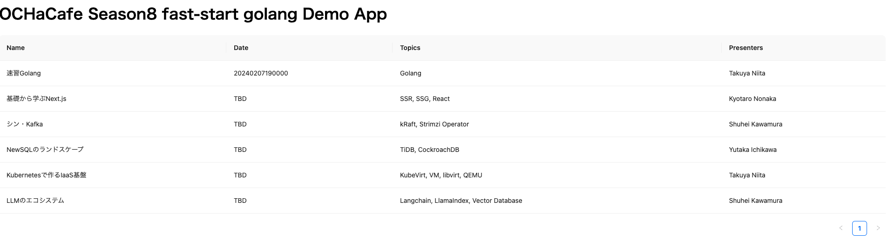

# ochacafe-faststart-go

## Oracle Cloud Hangout Cafe Season8 #1 Fast-Start Golang!!

### Directory Configuration

```
.
├── k8s
│   └── app.yaml -> デモアプリケーションのManifest
├── oke-app　-> デモアプリケーションのソースコード
│   ├── backend-app　-> バックエンドアプリ
│   └── frontend-app　-> フロントエンドアプリ(Next.js製。今回はおまけの位置付け)
└── README.md
```

### バックエンドアプリケーション(golang)の構成


```
.
├── cmd
│   └── demo
│       ├── main.go -> メイン処理
│       └── main_test.go -> テストコード
├── docker-compose.yaml -> UnitTest用PostgreSQLコンテナ起動ファイル
├── Dockerfile
├── go.mod
├── go.sum
└── internal
    └── pkg
        ├── crud -> CRUD処理(データベースへの操作)
        │   └── crud.go
        ├── db -> DB処理(コネクションやMigrateなど)
        │   └── db.go
        ├── http -> HTTPのメソッド(GET/POST/DELETE)に応じた処理
        │   └── methods.go
        └── repo -> データ定義
            └── items.go
```

### アプリケーションのローカル実行と動作確認

#### PodtgreSQLコンテナの実行

```sh
$ docker-compose up -d
[+] Running 2/2
 ✔ Network backend-app_default       Created                                                                                                                                                    0.0s 
 ✔ Container test-db            Started                                                                                                                                                     0.3s  
```


#### アプリケーション実行

```sh
$ go run oke-app/backend-app/cmd/demo/main.go
[GIN-debug] [WARNING] Creating an Engine instance with the Logger and Recovery middleware already attached.

[GIN-debug] [WARNING] Running in "debug" mode. Switch to "release" mode in production.
 - using env:   export GIN_MODE=release
 - using code:  gin.SetMode(gin.ReleaseMode)

[GIN-debug] GET    /items                    --> github.com/oracle-japan/ochacafe-faststart-go/oke-app/backend-app/http.GetAll (5 handlers)
[GIN-debug] GET    /items/:id                --> github.com/oracle-japan/ochacafe-faststart-go/oke-app/backend-app/http.GetItemById (5 handlers)
[GIN-debug] POST   /items                    --> github.com/oracle-japan/ochacafe-faststart-go/oke-app/backend-app/http.UpdateItem (5 handlers)
[GIN-debug] DELETE /items/:id                --> github.com/oracle-japan/ochacafe-faststart-go/oke-app/backend-app/http.DeleteItem (5 handlers)
[GIN-debug] [WARNING] You trusted all proxies, this is NOT safe. We recommend you to set a value.
Please check https://pkg.go.dev/github.com/gin-gonic/gin#readme-don-t-trust-all-proxies for details.
[GIN-debug] Environment variable PORT is undefined. Using port :8080 by default
[GIN-debug] Listening and serving HTTP on :8080
```

```sh
$ curl http://localhost:8080/items
[
    {
        "ID": 1,
        "CreatedAt": "2024-01-18T10:45:03.039866+09:00",
        "UpdatedAt": "2024-01-18T10:45:03.039866+09:00",
        "DeletedAt": null,
        "Name": "速習Golang",
        "Date": "20240207190000",
        "Topics": "Golang",
        "Presenters": "Takuya Niita"
    },
    {
        "ID": 2,
        "CreatedAt": "2024-01-18T10:45:03.039866+09:00",
        "UpdatedAt": "2024-01-18T10:45:03.039866+09:00",
        "DeletedAt": null,
        "Name": "基礎から学ぶNext.js",
        "Date": "TBD",
        "Topics": "SSR, SSG, React",
        "Presenters": "Kyotaro Nonaka"
    },
    {
        "ID": 3,
        "CreatedAt": "2024-01-18T10:45:03.039866+09:00",
        "UpdatedAt": "2024-01-18T10:45:03.039866+09:00",
        "DeletedAt": null,
        "Name": "シン・Kafka",
        "Date": "TBD",
        "Topics": "kRaft, Strimzi Operator",
        "Presenters": "Shuhei Kawamura"
    },
    {
        "ID": 4,
        "CreatedAt": "2024-01-18T10:45:03.039866+09:00",
        "UpdatedAt": "2024-01-18T10:45:03.039866+09:00",
        "DeletedAt": null,
        "Name": "NewSQLのランドスケープ",
        "Date": "TBD",
        "Topics": "TiDB, CockroachDB",
        "Presenters": "Yutaka Ichikawa"
    },
    {
        "ID": 5,
        "CreatedAt": "2024-01-18T10:45:03.039866+09:00",
        "UpdatedAt": "2024-01-18T10:45:03.039866+09:00",
        "DeletedAt": null,
        "Name": "Kubernetesで作るIaaS基盤",
        "Date": "TBD",
        "Topics": "KubeVirt, VM, libvirt, QEMU",
        "Presenters": "Takuya Niita"
    },
    {
        "ID": 6,
        "CreatedAt": "2024-01-18T10:45:03.039866+09:00",
        "UpdatedAt": "2024-01-18T10:45:03.039866+09:00",
        "DeletedAt": null,
        "Name": "LLMのエコシステム",
        "Date": "TBD",
        "Topics": "Langchain, LlamaIndex, Vector Database",
        "Presenters": "Shuhei Kawamura"
    }
]
```

###　UnitTestの実行とカバレッジレポート出力

#### テスト実行

```sh
$ cd oke-app/backend-app/cmd/demo
$ go test -coverpkg=./... -cover -coverprofile=cover.out
[GIN-debug] [WARNING] Creating an Engine instance with the Logger and Recovery middleware already attached.

[GIN-debug] [WARNING] Running in "debug" mode. Switch to "release" mode in production.
 - using env:   export GIN_MODE=release
 - using code:  gin.SetMode(gin.ReleaseMode)

[GIN-debug] GET    /items                    --> github.com/oracle-japan/ochacafe-faststart-go/oke-app/backend-app/http.GetAll (5 handlers)
[GIN-debug] GET    /items/:id                --> github.com/oracle-japan/ochacafe-faststart-go/oke-app/backend-app/http.GetItemById (5 handlers)
[GIN-debug] POST   /items                    --> github.com/oracle-japan/ochacafe-faststart-go/oke-app/backend-app/http.UpdateItem (5 handlers)
[GIN-debug] DELETE /items/:id                --> github.com/oracle-japan/ochacafe-faststart-go/oke-app/backend-app/http.DeleteItem (5 handlers)
[GIN] 2024/01/18 - 11:20:15 | 200 |   24.287988ms |                 | GET      "/items"
[GIN-debug] [WARNING] Creating an Engine instance with the Logger and Recovery middleware already attached.

[GIN-debug] [WARNING] Running in "debug" mode. Switch to "release" mode in production.
 - using env:   export GIN_MODE=release
 - using code:  gin.SetMode(gin.ReleaseMode)

[GIN-debug] GET    /items                    --> github.com/oracle-japan/ochacafe-faststart-go/oke-app/backend-app/http.GetAll (5 handlers)
[GIN-debug] GET    /items/:id                --> github.com/oracle-japan/ochacafe-faststart-go/oke-app/backend-app/http.GetItemById (5 handlers)
[GIN-debug] POST   /items                    --> github.com/oracle-japan/ochacafe-faststart-go/oke-app/backend-app/http.UpdateItem (5 handlers)
[GIN-debug] DELETE /items/:id                --> github.com/oracle-japan/ochacafe-faststart-go/oke-app/backend-app/http.DeleteItem (5 handlers)
[GIN] 2024/01/18 - 11:20:15 | 200 |    20.98895ms |                 | GET      "/items"
[GIN] 2024/01/18 - 11:20:15 | 200 |   23.427264ms |                 | GET      "/items/1"
[GIN-debug] [WARNING] Creating an Engine instance with the Logger and Recovery middleware already attached.

[GIN-debug] [WARNING] Running in "debug" mode. Switch to "release" mode in production.
 - using env:   export GIN_MODE=release
 - using code:  gin.SetMode(gin.ReleaseMode)

[GIN-debug] GET    /items                    --> github.com/oracle-japan/ochacafe-faststart-go/oke-app/backend-app/http.GetAll (5 handlers)
[GIN-debug] GET    /items/:id                --> github.com/oracle-japan/ochacafe-faststart-go/oke-app/backend-app/http.GetItemById (5 handlers)
[GIN-debug] POST   /items                    --> github.com/oracle-japan/ochacafe-faststart-go/oke-app/backend-app/http.UpdateItem (5 handlers)
[GIN-debug] DELETE /items/:id                --> github.com/oracle-japan/ochacafe-faststart-go/oke-app/backend-app/http.DeleteItem (5 handlers)
[GIN] 2024/01/18 - 11:20:15 | 200 |   26.024088ms |                 | POST     "/items"
[GIN-debug] [WARNING] Creating an Engine instance with the Logger and Recovery middleware already attached.

[GIN-debug] [WARNING] Running in "debug" mode. Switch to "release" mode in production.
 - using env:   export GIN_MODE=release
 - using code:  gin.SetMode(gin.ReleaseMode)

[GIN-debug] GET    /items                    --> github.com/oracle-japan/ochacafe-faststart-go/oke-app/backend-app/http.GetAll (5 handlers)
[GIN-debug] GET    /items/:id                --> github.com/oracle-japan/ochacafe-faststart-go/oke-app/backend-app/http.GetItemById (5 handlers)
[GIN-debug] POST   /items                    --> github.com/oracle-japan/ochacafe-faststart-go/oke-app/backend-app/http.UpdateItem (5 handlers)
[GIN-debug] DELETE /items/:id                --> github.com/oracle-japan/ochacafe-faststart-go/oke-app/backend-app/http.DeleteItem (5 handlers)
[GIN] 2024/01/18 - 11:20:15 | 200 |   26.021975ms |                 | GET      "/items"
[GIN] 2024/01/18 - 11:20:15 | 200 |   30.236654ms |                 | DELETE   "/items/1"
PASS
coverage: 76.1% of statements in ./...
ok      github.com/oracle-japan/ochacafe-faststart-go/oke-app/backend-app       0.239s
```

#### カバレッジレポート出力(HTML形式)

```sh
$ go tool cover -html=cover.out -o cover.html
```

#### レポート確認

Chromeなどで確認できる


### ソースコードドキュメント

#### godoc

godocをインストールする

```sh
go install golang.org/x/tools/cmd/godoc@latest
```

起動する

```sh
$ godoc -http=:8080
using module mode; GOMOD=/home/opc/ochacafe-faststart-go/oke-app/backend-app/go.mod
```

`http://localhost:8080`にアクセスする

#### pkgsite

pkgsiteをインストールする

```sh
$ go install golang.org/x/pkgsite/cmd/pkgsite@latest
```

起動

```sh
$ pkgsite
2024/01/18 11:42:32 Info: go/packages.Load(["all"]) loaded 388 packages from . in 913.238129ms
2024/01/18 11:42:33 Info: go/packages.Load(std) loaded 276 packages from /home/opc/sdk/go1.21.6 in 1.464614884s
2024/01/18 11:42:33 Info: FetchDataSource: fetching github.com/oracle-japan/ochacafe-faststart-go/oke-app/backend-app@v0.0.0
2024/01/18 11:42:33 Info: FetchDataSource: fetching std@latest
2024/01/18 11:42:33 Info: FetchDataSource: fetched github.com/oracle-japan/ochacafe-faststart-go/oke-app/backend-app@v0.0.0 using *fetch.goPackagesModuleGetter in 18.803446ms with error <nil>
2024/01/18 11:42:33 Info: Listening on addr http://localhost:8080
```

`http://localhost:8080/github.com/oracle-japan/ochacafe-faststart-go/oke-app/backend-app`にアクセスする


### Kubernetes(OKE)上での実行

#### OKEのプロビジョニング

OKEのプロビジョニングは[こちら](https://oracle-japan.github.io/ocitutorials/cloud-native/oke-for-commons/)を参考に実施

#### OCI Database with PostgreSQLのプロビジョニング

##### プロビジョニング

OCI Database with PostgreSQLのプロビジョニングは[こちら](https://qiita.com/yama6/items/ec8cd7652a1c0cf9e13d#3-oci-database-with-postgresql%E3%81%AE%E4%BD%9C%E6%88%90)を参考に実施

##### データベースの作成

上記で作成したPostgreSQLにpsqlでログイン

```sh
$ psql -h <endpoint> -U <usename> -d postgres
```

データベース(demo)を作成

```sh
postgres=> create database demo;
CREATE DATABASE
```

#### OCI Application Performance Monitoringのプロビジョニング

[こちら](https://qiita.com/western24/items/bfd9bd9e6a20afe43376#apm%E3%83%89%E3%83%A1%E3%82%A4%E3%83%B3%E3%81%AE%E4%BD%9C%E6%88%90)を参考に実施

プロビジョニング時に指定したユーザ名とパスワード、プロビジョニング時に確認できるエンドポイントをメモ

##### データアップロードエンドポイントとプライベートデータキーの取得

上記の手順に従い、データアップロードエンドポイントとプライベートデータキーをメモ

#### OKEへのSecret登録

##### OCI Database with PostgreSQLの情報

```sh
$ kubectl create secret generic db-secret --from-literal=username=<OCI Database with PostgreSQLプロビジョニング時に指定したユーザ名> --from-literal=password=<OCI Database with PostgreSQLプロビジョニング時に指定したパスワード> --from-literal=host=<OCI Database with PostgreSQLのエンドポイント>  
```

##### OCI Application Performance Monitoringの情報

```sh
$ kubectl create secret generic apm-secret --from-literal=endpoint=<APMのエンドポイント> --from-literal=key=<APMのプライベートデータキー>  
```

#### 動作確認

##### デプロイ

```sh
$ kubectl apply -f k8s/app.yaml 
```

##### アクセス確認

```sh
$ kubectl get svc golang-demo-lb
NAME             TYPE           CLUSTER-IP    EXTERNAL-IP     PORT(S)        AGE
golang-demo-lb   LoadBalancer   10.96.75.89   xxx.xxx.xxx.xxx   80:31898/TCP   20h
```

EXTERNAL-IPでアクセス



OCI APMのトレースエクスプローラーからの確認


